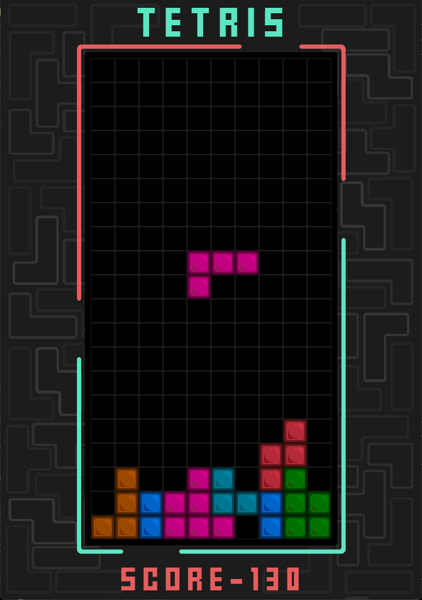
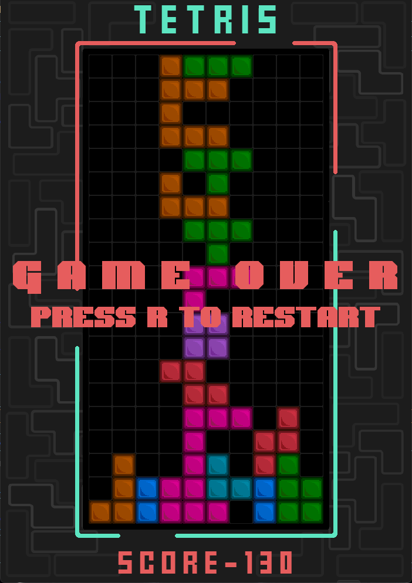

# Tetris Game Project

## Overview
This project is a simple implementation of the classic game Tetris using Python and the Pygame library.

## Screenshots

<p align="center">
  
</p><p align="center">
  
</p>

## Installation
To run the game, you'll need Python installed on your system along with the Pygame library.

1. Clone this repository to your local machine.
2. Make sure you have Python installed. You can download it from [here](https://www.python.org/downloads/).
3. Install Pygame by running the following command: 
```bash
pip install pygame
```

## How to Play
1. Run the `tetris.py` file.
```bash
python tetris.py
```
2. Use the arrow keys to move the falling blocks left, right, or down.
3. Use the `Up` arrow key to rotate the falling block.
4. The objective is to complete horizontal lines without any gaps. When a line is completed, it will disappear, and the player earns points.
5. If the blocks reach the top of the screen, the game ends.

## Controls
- Left Arrow: Move block left
- Right Arrow: Move block right
- Down Arrow: Move block down (faster)
- Up Arrow: Rotate block

## Files
- `main.py`: Main Python script containing the game logic.
- `assets/`: Directory containing game assets such as images and sounds.

## Credits
- Pygame: A cross-platform set of Python modules designed for writing video games. [Pygame Website](https://www.pygame.org/)
- Tetris concept originally created by Alexey Pajitnov.

## License
This project is licensed under the MIT License - see the [LICENSE](LICENSE) file for details.

